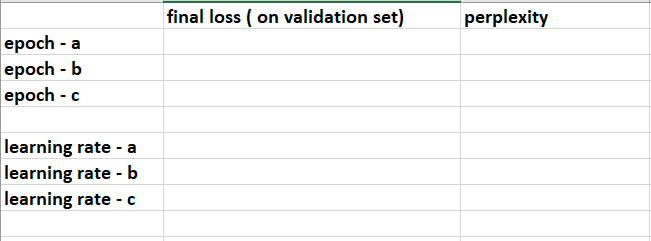

Assignment A2 : Fine-Tuning a State-of-Art Language Model for Text Generation
-------------------------------------------------------------

- The objective of this assignment is to teach you the fundamentals of working with Neural LMs. On completion, you will be able to use same techniques and ideas for working with almost any Neural LM out there for any kind (domain) of dataset you may have. 
- In this assignment you're expected to fine-tune [GPT-2](https://openai.com/blog/better-language-models/) (precursor to the GPT-3) Language Model on a given set of corpora. After fine-tuning, you will generate some text using the same LM.
- Note that this is an "hands-on" assignment in its truest sense so we won't be giving you any starter code like we did in the first assignment. Rather, we'll be providing curated list of resources (blogs) using which and upon further exploration you can easily complete the assignment. 
- Just to clarify, you'd definitely need to put good effort in exploration. The more you do, the more you'll learn. 

So let's start with the assignment, shall we?

## Assignment Specifics:

**Task:** Fine-tune GPT-2 on two Corpora.

**Corpora:** 
 - [Tiny Shakespeare](https://huggingface.co/datasets/tiny_shakespeare) - 40,000 lines of Shakespeare from a variety of Shakespeare's plays.
 - [Bill Sum](https://huggingface.co/datasets/billsum) - Summarization of US Congressional and California state bills.

**Platform:** You'll be using Google Collab.

**Tools:** You'll be using the [HuggingFace](https://huggingface.co/) set of tools for this assignment. This library is the industry+research standard for working with most of SOTA NLP. 

**Curated Resources (for a suitable starting point):**
 - [Fine-Tuning GPT-2 for Text Generation](https://towardsdatascience.com/fine-tuning-gpt2-for-text-generation-using-pytorch-2ee61a4f1ba7)
 - [Fine-Tuning GPT-2 on Colab](https://towardsdatascience.com/fine-tuning-gpt2-on-colab-gpu-for-free-340468c92ed)
 - [Fine-Tuning on Colab and uses TF also discusses different params of fine-tuning](https://towardsdatascience.com/natural-language-generation-part-2-gpt-2-and-huggingface-f3acb35bc86a)

**Expected Submission Format:**
 - You will be submitting three things as part of the submission zip file. 
 - First, a short screen video recording of your model generating some text based on the input text for both the Corpora.
 - Second, the final version of the code (Google Collab notebook + any scripts you used).
 - Third, we want you to submit a summary of your training experiments in the following format:

 - You have to first run the fine-tuning for epochs 1, 3, 5 and 7 using the learning rate 5e-5 and tabulate the table with loss and perplexity values.
 - Once you are done with the above, you have to find 3 learning rates a, b and c that give the model better perplexity values by fixing the epoch as 5. Feel free to experiment yourself or use Google to learn from other's experiments.
 
**Where to ask questions/read others questions if you're stuck?:**
 - [Hugging Face Forums](https://discuss.huggingface.co/)
 - [Hugging Face Github Issues](https://github.com/huggingface/transformers/issues)
 - Feel free to refer to any such online forums like StackOverflow etc.

**Note:**

- This is an exploratory assignment so minimum help will be provided. Please utilize the power of Google to find solutions for any issues you may have or for code snippets you may need. There are plenty of blogs online.

- Make sure to first go through all the resources "hands-on" and understand different aspects at play before jumping into the assignment.

