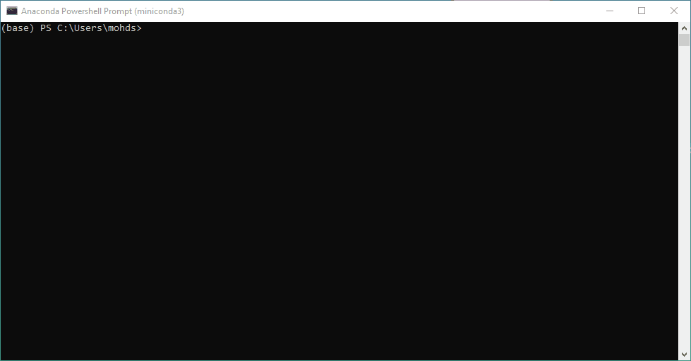
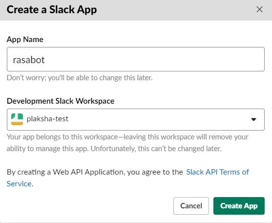

## I. Installing Prerequisites

Apart from Rasa, we have three main pre-requisite softwares for this project - namely Git, Miniconda (Python and its packages) and Ngrok. The following are instructions to install each:

A. Install Git from the following link, select the right version of installer (32 or 64 bit) based on your windows. 

**[Ignore this step if you already have Git installed.]**

Follow the instructions and use default options in the setup:
```
https://git-scm.com/download/win
```

B. Install miniconda for windows from the following link, select Python 3.8 version and the right version of installer (32 or 64 bit) based on your windows. 

**[Ignore this step if you already have anaconda/miniconda installed.]**

Follow the instructions and use default options in the setup:

```
https://docs.conda.io/en/latest/miniconda.html
```

C. Download ngrok for windows from here (you'll have to extract the downloaded zip file):

```
https://ngrok.com/download
```
This will be useful later for assignments.

## II. Installing and Setting up Rasa

a. Open "start menu" and search for "anaconda powershell":


b. Select "Run as Administrator", a new powershell window will appear:


c. We will setup a new virtual environment (a separate python environment for Rasa related libraries) with the following code:

```
conda create --name rasa python=3.8
```

You will be asked for confirmation to proceed, type "y" for yes and press ENTER to proceed.

Here is how this process will look like:



d. Activate the new environment to use it:

```
conda activate rasa
```

e. Install the latest Rasa:

```
pip install rasa
```

The above step will take a while (based on your internet speed) as Rasa and it's dependencies will be downloaded and installed.

**Note:**

If you get the "Microsoft Build tool error":

 - Go to https://visualstudio.microsoft.com/downloads/#build-tools-for-visual-studio-2019

 - Select only "Build Tools for Visual Studio 2019". Download and Install.

 - Re-run the rasa install command.

f. Install and setup spaCy (Rasa uses it internally), run the following commands one after another:
```
pip install spacy
```
```
python -m spacy download en_core_web_md
```
```
python -m spacy link en_core_web_md en
```

Once all of the commands are successfully run, it will say "linking successfull":


Note that the above set of commands will also take some time as spaCy downloads its basic "language models".

## III. Setting up the project

a. Download the project code from github using the following command:

```
git clone https://github.com/mohdsanadzakirizvi/plaksha_rasa.git
```

b. Install additional dependencies by this command:

```
pip install -r ../requirements.txt
```

Once  the above command is finished, you have the project code with you :) 

## IV. Getting Slack API Keys

a. First you need to create a slack workspace,  for instructions on how to create one you can refer this link:

https://slack.com/intl/en-gb/help/articles/206845317-Create-a-Slack-workspace

Select the "Desktop" instructions.

b. Now that we have a workspace to experiment with, we need an application to attach your bot. 

Create the app on the below link:

https://api.slack.com/apps

c. Click on “Create App”, give a name to the app like "rasabot", and select your workspace (the one that you created in step a):




d. Head over to "OAuth & Permissions" and scroll down to Scopes. 

Scopes give your app permission to do things in your workspace.


To get started, you should at least add the following scopes:

 - app_mentions:read,
 - channels:history,
 - chat:write,
 - groups:history,
 - im:history,
 - mpim:history and
 - reactions:write.

e. On the "OAuth & Permissions" page, click "Install App to Workspace" to add the bot to your workspace:


With the above set of steps done, you have nicely done majority of the setup work for the project. 

Congratulations! Now going forward, things will be smooth :)